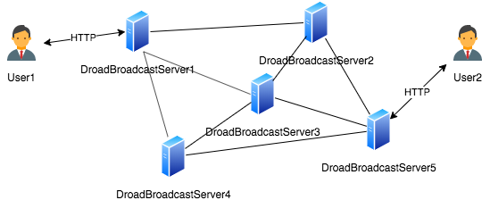
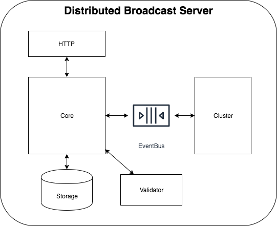

# Distributed Broadcast Service
This project implements a distributed broadcast system, where nodes reach eventual consistency on validated news.

Note that each node could join or leave the system at any time, make sure nodes can discover each other (with or without a centural registry).

Here lists pseudocode of behaviour offered to clients by a single node:
```go
package server
type Data struct {
    id string   
    raw string
    signature string
}
 
type BroadcastService interface {
    // Returns true if data is valid and accepted
    PostNewData(data Data)

    // Return all data received in the past 24h
    ListAllRecentData() []Data
}
``` 

# Architecture
## Overview


A server discovers other servers and establish connections with them, which compose a broadcast system with high availability. 
User can interact with server through http to post or get rencent data.

The whole broadcast system keeps working as long as any server survives.


##  Distributed Broadcast Server


A server is composed with 5 modules: 
- HTTP：HTTP module receives request from client, it offers apis for data access. You can also implement your own version with different protocols like grpc or homemade protocol.
- EventBus: EventBus is responsible for data transmission through the whole server. The `EventBus` interface defines `Publish` and `Subscribe` method. A naive implementation with native buffered channel in golng is offered, you are free to implement your own version and integrate it to the server. 
- Cluster: Cluster module manages discovered node and handles communication with them. This project offers implementation based on [go-libp2p](https://github.com/libp2p/go-libp2p) PubSubService.
- Storage: Storage stores data in recent 24 hours. This project use [go-cache](https://github.com/patrickmn/go-cache) which offers time-expiration.
- Validator: Validator validates the genuineness of the incoming data.
- Core: Core offers `Deliver`, `Events` methods: `Deliver` handles incoming data from client or other servers, a valid data will be stored it doesn't exist or have former timestamp. 
After that a broadcast event will be published and you can get notified by subscribing `Event` method.
Additionally, Core scans and broadcast all stored data periodically(20 seconds) make sure that the whole system reaches eventual consistency. 


# QuickStart
Pick executable listed in `build` directory for your operating system, for example, `build/macos/distributed-broad-systemserver-1.0`.
To start a broadcast server, run following comand to start a node listening port`8080`:
```
./build/macos/distributed-broad-systemserver-1.0 -httpport=8080
```

then send a http request to post new data, signature is MD5 digest of raw data, for example, `echo -n newmessage | md5`:
```cassandraql
curl --location --request POST 'http://localhost:8081/postNewData' \
--header 'Content-Type: application/json;' \
--data-raw '{
    "id": "id",
    "raw": "newmessage",
    "signature": "fbf9957b19f15006367d7702a10d6463"
}'
```

You can fetch all recent data with
```cassandraql
curl --location --request POST 'http://localhost:8080/listAllRecentData' \
--header 'Content-Type: application/json'
```

open a new terminal, start another server on 8081:
```cassandraql
./build/macos/distributed-broad-systemserver-1.0 -httpport=8081
```

Wait for 20 seconds and fetch data from new server, you can see that new server reach consistency with other servers on all post data: 
```cassandraql
curl --location --request POST 'http://localhost:8081/listAllRecentData' \
--header 'Content-Type: application/json'
```
